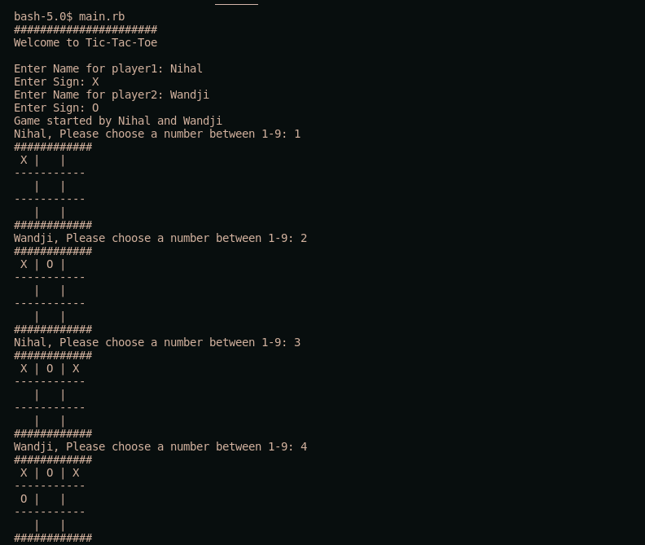

# TIC-TAC-TOE

> This project is a playable tic tac toe game built using ruby. OOP principles were used in order to implement the game logic.



## Built With

- Ruby

## Getting Started

To get a local copy up and running the following instructions.

### Prerequisites

Ruby installed in local machine.

### Install

1. Clone the repository to your machine via :

```sh
$ git clone https://github.com/wandji20/tic-tac-toe
```

2. Navigate to the project folder and execute the "bin/main.rb" file by typing ./bin/main.rb in terminal.


### Gameplay Instructions

1. Find someone to play with.
2. As the file is executed the game will ask you to first input Player 1 name and symbol to be used for the board. The same will be repeated for player 2. 
3. Player 1 will be prompted to enter a number from 1-9 representing a field in the tic-tac-toe grid(3x3), once the player obliges, his symbol will be marked in his selected spot.
4. Player 2 will be asked to repeat as above.
5. The game will keep alternating players until a win or draw is achieved.
6. To win the game, a player must fill out a line with his symbol vertically, horizontally, or diagonally.
7. A draw is reached when neither player manages the above and the grid is filled.

## Authors

👤 **Author1**

- GitHub: [@apricot12](https://github.com/apricot12)
- Twitter: [@apricotfoxtrot](https://twitter.com/apricotfoxtrot)
- LinkedIn: [LinkedIn](https://linkedin.com/aprikot-web)

👤 **Author2**

- GitHub: [@wandji20](https://github.com/wandji20)
- Twitter: [@wandjibertrand](https://twitter.com/wandjibertrand)
- LinkedIn: [LinkedIn](https://www.linkedin.com/in/wandji-bertrand-5232621b2/)

## 🤝 Contributing

Contributions, issues, and feature requests are welcome!

Feel free to check the [issues page](issues/).

## Show your support

Give a ⭐️ if you like this project!
